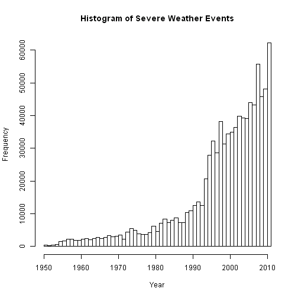
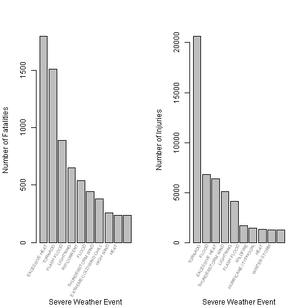
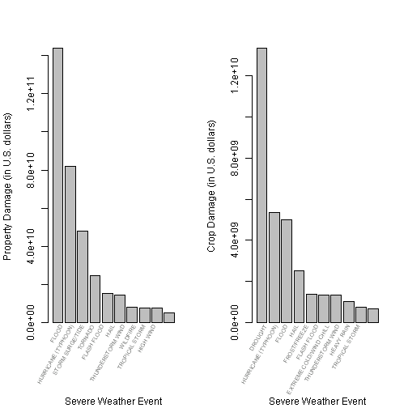

Reproducible Research: Peer Assessment 2
========================================
* Kevin Oster 
* August 2014


## Analysis of Severe Weather Events on Public Health and the Economy in the United States


### Synopsis
Storms and other severe weather events can cause both public health and economic problems for communities and municipalities. Many severe events can result in fatalities, injuries, and property damage, and preventing such outcomes to the extent possible is a key concern.

In this report, we will utilize the U.S. National Oceanic and Atmospheric Administration's (NOAA) storm database. The NOAA storm database tracks characteristics of major storms and weather events in the United States, including when and where they occur, as well as estimates of any fatalities, injuries, and property damage. These characteristics will be used to analyze the impact of different weather events on public health and the economy. From 1996 to present, 48 standardized event types are recorded as defined in [NWS Directive 10-1605](https://d396qusza40orc.cloudfront.net/repdata%2Fpeer2_doc%2Fpd01016005curr.pdf). We will utilize this standardized event list and look at data from 1996 and following years for this analysis.

### Data Processing

RStudio (version 0.98.977), in conjunction with R (version 3.1.1), were used in the processing and analysis of the data. We will make use of the following libraries:

```r
library(stringr)
```

The [Storm Data](https://d396qusza40orc.cloudfront.net/repdata%2Fdata%2FStormData.csv.bz2)
[47Mb] can be downloaded from the course website to the current working directory. We load the NOAA storm database only if the data is not already in the working environment:

```r
if (!"stormData" %in% ls()) {
    stormData <- read.csv(bzfile("repdata-data-StormData.csv.bz2"))
}
```


```r
dim(stormData)
```

```
## [1] 902297     37
```

There are a total of  902297 severe weather events in the storm database provided. The memory usage of stormData is 397.8 Mb bytes.


```r
names(stormData)
```

```
##  [1] "STATE__"    "BGN_DATE"   "BGN_TIME"   "TIME_ZONE"  "COUNTY"    
##  [6] "COUNTYNAME" "STATE"      "EVTYPE"     "BGN_RANGE"  "BGN_AZI"   
## [11] "BGN_LOCATI" "END_DATE"   "END_TIME"   "COUNTY_END" "COUNTYENDN"
## [16] "END_RANGE"  "END_AZI"    "END_LOCATI" "LENGTH"     "WIDTH"     
## [21] "F"          "MAG"        "FATALITIES" "INJURIES"   "PROPDMG"   
## [26] "PROPDMGEXP" "CROPDMG"    "CROPDMGEXP" "WFO"        "STATEOFFIC"
## [31] "ZONENAMES"  "LATITUDE"   "LONGITUDE"  "LATITUDE_E" "LONGITUDE_"
## [36] "REMARKS"    "REFNUM"
```

The data fields are explained in the [Storm Events codebook](http://ire.org/media/uploads/files/datalibrary/samplefiles/Storm%20Events/layout08.doc). Documentation is also available on how some of the variables are constructed/defined:

* National Weather Service [Storm Data Documentation](https://d396qusza40orc.cloudfront.net/repdata%2Fpeer2_doc%2Fpd01016005curr.pdf)
* National Climatic Data Center Storm Events [FAQ](https://d396qusza40orc.cloudfront.net/repdata%2Fpeer2_doc%2FNCDC%20Storm%20Events-FAQ%20Page.pdf)

For this analysis, we will make use of the following data fields: 

* **BGN_DATE**: Date the storm event began
* **EVTYPE**: Type of storm event. Take note that similar storm events can be listed using different wording e.g. "coastal flood" and "coastal flooding".
* **FATALITIES**: Number directly killed
* **INJURIES**: Number directly injured
* **PROPDMG**: Property damage in whole numbers and hundredths
* **PROPDMGEXP**: A multiplier where Hundred (H), Thousand (K), Million (M), Billion (B)
* **CROPDMG**: Crop damage in whole numbers and hundredths
* **CROPDMGEXP**: A multiplier where Hundred (H), Thousand (K), Million (M), Billion (B)

We can subset the main storm database using only the fields needed for the analysis:

```r
if (!"storm_df" %in% ls()) {
    fields <- c("BGN_DATE", "EVTYPE", "FATALITIES", "INJURIES", "PROPDMG", "PROPDMGEXP", "CROPDMG", "CROPDMGEXP")
    storm_df <-stormData[fields]
    colnames(storm_df) = c("year", "evtype", "fatalities", "injuries", "propDmg", "propDmgExp", "cropDmg", "cropDmgExp")
    storm_df$year <- as.numeric(format(as.Date(storm_df$year, format = "%m/%d/%Y %H:%M:%S"), "%Y"))
    # trim whitespace and convert characters to uppercase
    storm_df$evtype <- as.factor(toupper(str_trim(as.character(storm_df$evtype))))
    storm_df$fatalities <- as.numeric(as.character(storm_df$fatalities))
    storm_df$injuries <- as.numeric(as.character(storm_df$injuries))
    storm_df$propDmg <- as.numeric(as.character(storm_df$propDmg))
    storm_df$propDmgExp <- as.factor(toupper(as.character(storm_df$propDmgExp)))
    storm_df$cropDmg <- as.numeric(as.character(storm_df$cropDmg))
    storm_df$cropDmgExp <- as.factor(toupper(as.character(storm_df$cropDmgExp)))
}
```

At this point, the memory usage of storm_df, the subsetted storm database, is 44.8 Mb bytes.

Events in the storm database are from 1950 to 2011. Let us take a look at the distribution of storm events:

```r
hist(storm_df$year, breaks = 61, xlab = "Year", main = "Histogram of Severe Weather Events")
```

 

From the histogram, we can see that the number of events tracked starts to increase significantly in the mid-1990s. As stated beforehand, we are limiting our analysis to the standardized events time frame (1996 to present):

```r
if (!"storm_post1995" %in% ls()) {
    storm_post1995 <- storm_df[(storm_df$year >= 1996),]
    str(storm_post1995)
}
```

Even with the standardized events time frame limitation, we still have a total of 653530 events to use in our analysis.

Before proceeding, let's check how closely the storm event types correspond to the list of standardized events:

```r
str(storm_post1995$evtype)
```

```
##  Factor w/ 762 levels "?","ABNORMAL WARMTH",..: 757 652 164 164 164 166 71 164 164 164 ...
```

Within the standardized events time frame, non-standard event types are still being used. Let's try to clean up what we can:

```r
levels(storm_post1995$evtype)[match("BLIZZARD SUMMARY",levels(storm_post1995$evtype))] <- "BLIZZARD"
levels(storm_post1995$evtype)[match("COASTAL FLOODING",levels(storm_post1995$evtype))] <- "COASTAL FLOOD"
levels(storm_post1995$evtype)[match("COASTAL FLOODING/EROSION",levels(storm_post1995$evtype))] <- "COASTAL FLOOD"
levels(storm_post1995$evtype)[match("COASTALFLOOD",levels(storm_post1995$evtype))] <- "COASTAL FLOOD"
levels(storm_post1995$evtype)[match("CSTL FLOODING/EROSION",levels(storm_post1995$evtype))] <- "COASTAL FLOOD"
levels(storm_post1995$evtype)[match("EROSION/CSTL FLOOD",levels(storm_post1995$evtype))] <- "COASTAL FLOOD"
levels(storm_post1995$evtype)[match("COLD WIND CHILL TEMPERATURES",levels(storm_post1995$evtype))] <- "COLD/WIND CHILL"
levels(storm_post1995$evtype)[match("LANDSLIDE",levels(storm_post1995$evtype))] <- "DEBRIS FLOW"
levels(storm_post1995$evtype)[match("LANDSLIDES",levels(storm_post1995$evtype))] <- "DEBRIS FLOW"
levels(storm_post1995$evtype)[match("MUD SLIDE",levels(storm_post1995$evtype))] <- "DEBRIS FLOW"
levels(storm_post1995$evtype)[match("MUDSLIDE",levels(storm_post1995$evtype))] <- "DEBRIS FLOW"
levels(storm_post1995$evtype)[match("MUDSLIDE/LANDSLIDE",levels(storm_post1995$evtype))] <- "DEBRIS FLOW"
levels(storm_post1995$evtype)[match("MUDSLIDES",levels(storm_post1995$evtype))] <- "DEBRIS FLOW"
levels(storm_post1995$evtype)[match("ROCK SLIDE",levels(storm_post1995$evtype))] <- "DEBRIS FLOW"
levels(storm_post1995$evtype)[match("PATCHY DENSE FOG",levels(storm_post1995$evtype))] <- "DENSE FOG"
levels(storm_post1995$evtype)[match("SMOKE",levels(storm_post1995$evtype))] <- "DENSE SMOKE"
levels(storm_post1995$evtype)[match("DUST DEVEL",levels(storm_post1995$evtype))] <- "DUST DEVIL"
levels(storm_post1995$evtype)[match("EXCESSIVE HEAT/DROUGHT",levels(storm_post1995$evtype))] <- "EXCESSIVE HEAT"
levels(storm_post1995$evtype)[match("BITTER WIND CHILL",levels(storm_post1995$evtype))] <- "EXTREME COLD/WIND CHILL"
levels(storm_post1995$evtype)[match("BITTER WIND CHILL TEMPERATURES",levels(storm_post1995$evtype))] <- "EXTREME COLD/WIND CHILL"
levels(storm_post1995$evtype)[match("EXCESSIVE COLD",levels(storm_post1995$evtype))] <- "EXTREME COLD/WIND CHILL"
levels(storm_post1995$evtype)[match("EXTREME COLD",levels(storm_post1995$evtype))] <- "EXTREME COLD/WIND CHILL"
levels(storm_post1995$evtype)[match("EXTREME WIND CHILL",levels(storm_post1995$evtype))] <- "EXTREME COLD/WIND CHILL"
levels(storm_post1995$evtype)[match("EXTREME WINDCHILL",levels(storm_post1995$evtype))] <- "EXTREME COLD/WIND CHILL"
levels(storm_post1995$evtype)[match("EXTREME WINDCHILL TEMPERATURES",levels(storm_post1995$evtype))] <- "EXTREME COLD/WIND CHILL"
levels(storm_post1995$evtype)[match("FLASH FLOOD/FLOOD",levels(storm_post1995$evtype))] <- "FLASH FLOOD"
levels(storm_post1995$evtype)[match("FLASH FLOODING",levels(storm_post1995$evtype))] <- "FLASH FLOOD"
levels(storm_post1995$evtype)[match("FLOOD/FLASH FLOOD",levels(storm_post1995$evtype))] <- "FLASH FLOOD"
levels(storm_post1995$evtype)[match("FLOOD/FLASH/FLOOD",levels(storm_post1995$evtype))] <- "FLASH FLOOD"
levels(storm_post1995$evtype)[match("FLOOD/STRONG WIND",levels(storm_post1995$evtype))] <- "FLOOD"
levels(storm_post1995$evtype)[match("MINOR FLOODING",levels(storm_post1995$evtype))] <- "FLOOD"
levels(storm_post1995$evtype)[match("RIVER FLOOD",levels(storm_post1995$evtype))] <- "FLOOD"
levels(storm_post1995$evtype)[match("RIVER FLOODING",levels(storm_post1995$evtype))] <- "FLOOD"
levels(storm_post1995$evtype)[match("STREET FLOODING",levels(storm_post1995$evtype))] <- "FLOOD"
levels(storm_post1995$evtype)[match("URBAN FLOOD",levels(storm_post1995$evtype))] <- "FLOOD"
levels(storm_post1995$evtype)[match("URBAN FLOODING",levels(storm_post1995$evtype))] <- "FLOOD"
levels(storm_post1995$evtype)[match("URBAN/SMALL STRM FLDG",levels(storm_post1995$evtype))] <- "FLOOD"
levels(storm_post1995$evtype)[match("URBAN/SML STREAM FLD",levels(storm_post1995$evtype))] <- "FLOOD"
levels(storm_post1995$evtype)[match("URBAN/SML STREAM FLDG",levels(storm_post1995$evtype))] <- "FLOOD"
levels(storm_post1995$evtype)[match("URBAN/STREET FLOODING",levels(storm_post1995$evtype))] <- "FLOOD"
levels(storm_post1995$evtype)[match("ICE FOG",levels(storm_post1995$evtype))] <- "FREEZING FOG"
levels(storm_post1995$evtype)[match("AGRICULTURAL FREEZE",levels(storm_post1995$evtype))] <- "FROST/FREEZE"
levels(storm_post1995$evtype)[match("COLD AND FROST",levels(storm_post1995$evtype))] <- "FROST/FREEZE"
levels(storm_post1995$evtype)[match("DAMAGING FREEZE",levels(storm_post1995$evtype))] <- "FROST/FREEZE"
levels(storm_post1995$evtype)[match("EARLY FROST",levels(storm_post1995$evtype))] <- "FROST/FREEZE"
levels(storm_post1995$evtype)[match("FIRST FROST",levels(storm_post1995$evtype))] <- "FROST/FREEZE"
levels(storm_post1995$evtype)[match("FREEZE",levels(storm_post1995$evtype))] <- "FROST/FREEZE"
levels(storm_post1995$evtype)[match("FROST",levels(storm_post1995$evtype))] <- "FROST/FREEZE"
levels(storm_post1995$evtype)[match("GLAZE",levels(storm_post1995$evtype))] <- "FROST/FREEZE"
levels(storm_post1995$evtype)[match("HARD FREEZE",levels(storm_post1995$evtype))] <- "FROST/FREEZE"
levels(storm_post1995$evtype)[match("LATE FREEZE",levels(storm_post1995$evtype))] <- "FROST/FREEZE"
levels(storm_post1995$evtype)[match("FUNNEL CLOUDS",levels(storm_post1995$evtype))] <- "FUNNEL CLOUD"
levels(storm_post1995$evtype)[match("GUSTY WIND/HAIL",levels(storm_post1995$evtype))] <- "HAIL"
levels(storm_post1995$evtype)[match("HAIL(0.75)",levels(storm_post1995$evtype))] <- "HAIL"
levels(storm_post1995$evtype)[match("HAIL/WIND",levels(storm_post1995$evtype))] <- "HAIL"
levels(storm_post1995$evtype)[match("LATE SEASON HAIL",levels(storm_post1995$evtype))] <- "HAIL"
levels(storm_post1995$evtype)[match("SMALL HAIL",levels(storm_post1995$evtype))] <- "HAIL"
levels(storm_post1995$evtype)[match("NON SEVERE HAIL",levels(storm_post1995$evtype))] <- "HAIL"
levels(storm_post1995$evtype)[match("HEAT WAVE",levels(storm_post1995$evtype))] <- "HEAT"
levels(storm_post1995$evtype)[match("HEATBURST",levels(storm_post1995$evtype))] <- "HEAT"
levels(storm_post1995$evtype)[match("EXCESSIVE RAIN",levels(storm_post1995$evtype))] <- "HEAVY RAIN"
levels(storm_post1995$evtype)[match("EXCESSIVE RAINFALL",levels(storm_post1995$evtype))] <- "HEAVY RAIN"
levels(storm_post1995$evtype)[match("GUSTY WIND/HVY RAIN",levels(storm_post1995$evtype))] <- "HEAVY RAIN"
levels(storm_post1995$evtype)[match("HEAVY PRECIPITATION",levels(storm_post1995$evtype))] <- "HEAVY RAIN"
levels(storm_post1995$evtype)[match("HEAVY RAIN AND WIND",levels(storm_post1995$evtype))] <- "HEAVY RAIN"
levels(storm_post1995$evtype)[match("HEAVY RAIN EFFECTS",levels(storm_post1995$evtype))] <- "HEAVY RAIN"
levels(storm_post1995$evtype)[match("HEAVY RAIN/HIGH SURF",levels(storm_post1995$evtype))] <- "HEAVY RAIN"
levels(storm_post1995$evtype)[match("HEAVY RAIN/WIND",levels(storm_post1995$evtype))] <- "HEAVY RAIN"
levels(storm_post1995$evtype)[match("HEAVY RAINFALL",levels(storm_post1995$evtype))] <- "HEAVY RAIN"
levels(storm_post1995$evtype)[match("LOCALLY HEAVY RAIN",levels(storm_post1995$evtype))] <- "HEAVY RAIN"
levels(storm_post1995$evtype)[match("PROLONGED RAIN",levels(storm_post1995$evtype))] <- "HEAVY RAIN"
levels(storm_post1995$evtype)[match("RAIN (HEAVY)",levels(storm_post1995$evtype))] <- "HEAVY RAIN"
levels(storm_post1995$evtype)[match("TORRENTIAL RAINFALL",levels(storm_post1995$evtype))] <- "HEAVY RAIN"
levels(storm_post1995$evtype)[match("TSTM HEAVY RAIN",levels(storm_post1995$evtype))] <- "HEAVY RAIN"
levels(storm_post1995$evtype)[match("EXCESSIVE SNOW",levels(storm_post1995$evtype))] <- "HEAVY SNOW"
levels(storm_post1995$evtype)[match("HEAVY SNOW SHOWER",levels(storm_post1995$evtype))] <- "HEAVY SNOW"
levels(storm_post1995$evtype)[match("HEAVY SNOW SQUALLS",levels(storm_post1995$evtype))] <- "HEAVY SNOW"
levels(storm_post1995$evtype)[match("HAZARDOUS SURF",levels(storm_post1995$evtype))] <- "HIGH SURF"
levels(storm_post1995$evtype)[match("HEAVY SURF",levels(storm_post1995$evtype))] <- "HIGH SURF"
levels(storm_post1995$evtype)[match("HEAVY SURF AND WIND",levels(storm_post1995$evtype))] <- "HIGH SURF"
levels(storm_post1995$evtype)[match("HEAVY SURF/HIGH SURF",levels(storm_post1995$evtype))] <- "HIGH SURF"
levels(storm_post1995$evtype)[match("HIGH SURF ADVISORIES",levels(storm_post1995$evtype))] <- "HIGH SURF"
levels(storm_post1995$evtype)[match("HIGH SURF ADVISORY",levels(storm_post1995$evtype))] <- "HIGH SURF"
levels(storm_post1995$evtype)[match("ROUGH SURF",levels(storm_post1995$evtype))] <- "HIGH SURF"
levels(storm_post1995$evtype)[match("DRY MICROBURST",levels(storm_post1995$evtype))] <- "HIGH WIND"
levels(storm_post1995$evtype)[match("HIGH WIND (G40)",levels(storm_post1995$evtype))] <- "HIGH WIND"
levels(storm_post1995$evtype)[match("HIGH WINDS",levels(storm_post1995$evtype))] <- "HIGH WIND"
levels(storm_post1995$evtype)[match("HURRICANE",levels(storm_post1995$evtype))] <- "HURRICANE (TYPHOON)"
levels(storm_post1995$evtype)[match("HURRICANE EDOUARD",levels(storm_post1995$evtype))] <- "HURRICANE (TYPHOON)"
levels(storm_post1995$evtype)[match("HURRICANE/TYPHOON",levels(storm_post1995$evtype))] <- "HURRICANE (TYPHOON)"
levels(storm_post1995$evtype)[match("TYPHOON",levels(storm_post1995$evtype))] <- "HURRICANE (TYPHOON)"
levels(storm_post1995$evtype)[match("ICESTORM/BLIZZARD",levels(storm_post1995$evtype))] <- "ICE STORM"
levels(storm_post1995$evtype)[match("LAKE EFFECT SNOW",levels(storm_post1995$evtype))] <- "LAKE-EFFECT SNOW"
levels(storm_post1995$evtype)[match("TSTM WIND AND LIGHTNING",levels(storm_post1995$evtype))] <- "LIGHTNING"
levels(storm_post1995$evtype)[match("MARINE TSTM WIND",levels(storm_post1995$evtype))] <- "MARINE THUNDERSTORM WIND"
levels(storm_post1995$evtype)[match("RIP CURRENTS",levels(storm_post1995$evtype))] <- "RIP CURRENT"
levels(storm_post1995$evtype)[match("FREEZING RAIN/SLEET",levels(storm_post1995$evtype))] <- "SLEET"
levels(storm_post1995$evtype)[match("SLEET STORM",levels(storm_post1995$evtype))] <- "SLEET"
levels(storm_post1995$evtype)[match("SLEET/FREEZING RAIN",levels(storm_post1995$evtype))] <- "SLEET"
levels(storm_post1995$evtype)[match("SNOW AND SLEET",levels(storm_post1995$evtype))] <- "SLEET"
levels(storm_post1995$evtype)[match("SNOW/SLEET",levels(storm_post1995$evtype))] <- "SLEET"
levels(storm_post1995$evtype)[match("ASTRONOMICAL HIGH TIDE",levels(storm_post1995$evtype))] <- "STORM SURGE/TIDE"
levels(storm_post1995$evtype)[match("BLOW-OUT TIDE",levels(storm_post1995$evtype))] <- "STORM SURGE/TIDE"
levels(storm_post1995$evtype)[match("BLOW-OUT TIDES",levels(storm_post1995$evtype))] <- "STORM SURGE/TIDE"
levels(storm_post1995$evtype)[match("STORM SURGE",levels(storm_post1995$evtype))] <- "STORM SURGE/TIDE"
levels(storm_post1995$evtype)[match("STRONG WIND GUST",levels(storm_post1995$evtype))] <- "STRONG WIND"
levels(storm_post1995$evtype)[match("STRONG WINDS",levels(storm_post1995$evtype))] <- "STRONG WIND"
levels(storm_post1995$evtype)[match("GUSTY THUNDERSTORM WIND",levels(storm_post1995$evtype))] <- "THUNDERSTORM WIND"
levels(storm_post1995$evtype)[match("GUSTY THUNDERSTORM WINDS",levels(storm_post1995$evtype))] <- "THUNDERSTORM WIND"
levels(storm_post1995$evtype)[match("THUNDERSTORM WIND (G40)",levels(storm_post1995$evtype))] <- "THUNDERSTORM WIND"
levels(storm_post1995$evtype)[match("TSTM WIND",levels(storm_post1995$evtype))] <- "THUNDERSTORM WIND"
levels(storm_post1995$evtype)[match("TSTM WIND (G45)",levels(storm_post1995$evtype))] <- "THUNDERSTORM WIND"
levels(storm_post1995$evtype)[match("TSTM WIND (41)",levels(storm_post1995$evtype))] <- "THUNDERSTORM WIND"
levels(storm_post1995$evtype)[match("TSTM WIND (G35)",levels(storm_post1995$evtype))] <- "THUNDERSTORM WIND"
levels(storm_post1995$evtype)[match("TSTM WIND (G40)",levels(storm_post1995$evtype))] <- "THUNDERSTORM WIND"
levels(storm_post1995$evtype)[match("TSTM WIND (G45)",levels(storm_post1995$evtype))] <- "THUNDERSTORM WIND"
levels(storm_post1995$evtype)[match("TSTM WIND 40",levels(storm_post1995$evtype))] <- "THUNDERSTORM WIND"
levels(storm_post1995$evtype)[match("TSTM WIND 45",levels(storm_post1995$evtype))] <- "THUNDERSTORM WIND"
levels(storm_post1995$evtype)[match("TSTM WIND G45",levels(storm_post1995$evtype))] <- "THUNDERSTORM WIND"
levels(storm_post1995$evtype)[match("TSTM WIND/HAIL",levels(storm_post1995$evtype))] <- "THUNDERSTORM WIND"
levels(storm_post1995$evtype)[match("TSTM WINDS",levels(storm_post1995$evtype))] <- "THUNDERSTORM WIND"
levels(storm_post1995$evtype)[match("TSTM WND",levels(storm_post1995$evtype))] <- "THUNDERSTORM WIND"
levels(storm_post1995$evtype)[match("VOLCANIC ASH PLUME",levels(storm_post1995$evtype))] <- "VOLCANIC ASH"
levels(storm_post1995$evtype)[match("VOLCANIC ASHFALL",levels(storm_post1995$evtype))] <- "VOLCANIC ASH"
levels(storm_post1995$evtype)[match("WATERSPOUTS",levels(storm_post1995$evtype))] <- "WATERSPOUT"
levels(storm_post1995$evtype)[match("WILD/FOREST FIRE",levels(storm_post1995$evtype))] <- "WILDFIRE"
levels(storm_post1995$evtype)[match("WINTER MIX",levels(storm_post1995$evtype))] <- "WINTER WEATHER"
levels(storm_post1995$evtype)[match("WINTER WEATHER MIX",levels(storm_post1995$evtype))] <- "WINTER WEATHER"
levels(storm_post1995$evtype)[match("WINTER WEATHER/MIX",levels(storm_post1995$evtype))] <- "WINTER WEATHER"
levels(storm_post1995$evtype)[match("WINTERY MIX",levels(storm_post1995$evtype))] <- "WINTER WEATHER"
levels(storm_post1995$evtype)[match("WINTRY MIX",levels(storm_post1995$evtype))] <- "WINTER WEATHER"
```

Let's check how we did with the first pass of cleaning the storm event types:

```r
str(storm_post1995$evtype)
```

```
##  Factor w/ 762 levels "?","ABNORMAL WARMTH",..: 757 652 164 164 164 166 71 164 164 164 ...
```

That's somewhat better. We'll proceed to the analysis. If any non-standard event types appear in the results, we will need to take another pass at cleaning the storm event types.


#### Processing data to look at public health impact

To determine the public health impact, we will use the number of **fatalities** and **injuries** caused by severe weather events. We will determine the ten most severe weather events for each category.

```r
sumFatalities <- aggregate(fatalities ~ evtype, data = storm_post1995, sum)
sumFatalities <- sumFatalities[order(sumFatalities$fatalities, decreasing = TRUE),]
top10Fatalities <- sumFatalities[1:10,]

sumInjuries <- aggregate(injuries ~ evtype, data = storm_post1995, sum)
sumInjuries <- sumInjuries[order(sumInjuries$injuries, decreasing = TRUE),]
top10Injuries <- sumInjuries[1:10,]
```


#### Processing data to look at the economic impact

To determine the impact of severe weather events on the economy, we will use the **property damage** and **crop damage** data. To calculate the amount of damage (in dollars) caused by a severe weather event, we need to take a given number (in `PROPDMG` or `CROPDMG`) and increase it by the corresponding multiplier (in `PROPDMGEXP` or `CROPDMGEXP`).

The multipliers present in the standardized events time frame are:

```r
unique(storm_post1995$propDmgExp)
```

```
## [1] K   M B 0
## Levels:  - ? + 0 1 2 3 4 5 6 7 8 B H K M
```

```r
unique(storm_post1995$cropDmgExp)
```

```
## [1] K   M B
## Levels:  ? 0 2 B K M
```

As previously stated, the officially listed multipliers are:

* **H** => Hundred (x 1e2)
* **K** => Thousand (x 1e3)
* **M** => Million (x 1e6)
* **B** => Billion (x 1e9)


```r
dmgExp = c("H", "K", "M", "B")
dmgMultiplier = c(1e+02, 1e+03, 1e+06, 1e+09)
```

We will use the base dollar amount if the corresponding multiplier is not among those officially listed. Let's calculate the **property damage** and **crop damage** for each severe weather event in our analysis:

```r
storm_post1995$propertyDamage <- ifelse(storm_post1995$propDmgExp %in% dmgExp, dmgMultiplier[match(storm_post1995$propDmgExp, dmgExp)] * storm_post1995$propDmg, storm_post1995$propDmg)

sumPropertyDamage <- aggregate(propertyDamage ~ evtype, data = storm_post1995, sum)
sumPropertyDamage <- sumPropertyDamage[order(sumPropertyDamage$propertyDamage, decreasing = TRUE),]
top10PropertyDamage <- sumPropertyDamage[1:10,]

storm_post1995$cropDamage <- ifelse(storm_post1995$cropDmgExp %in% dmgExp, dmgMultiplier[match(storm_post1995$cropDmgExp, dmgExp)] * storm_post1995$cropDmg, storm_post1995$cropDmg)

sumCropDamage <- aggregate(cropDamage ~ evtype, data = storm_post1995, sum)
sumCropDamage <- sumCropDamage[order(sumCropDamage$cropDamage, decreasing = TRUE),]
top10CropDamage <- sumCropDamage[1:10,]
```


### Results

In terms of public health impact, we have determined the ten most severe weather events for **fatalities** and **injuries**:

```r
top10Fatalities
```

```
##                      evtype fatalities
## 46           EXCESSIVE HEAT       1797
## 252                 TORNADO       1511
## 54              FLASH FLOOD        887
## 106               LIGHTNING        651
## 159             RIP CURRENT        542
## 55                    FLOOD        444
## 65        THUNDERSTORM WIND        378
## 10  EXTREME COLD/WIND CHILL        257
## 38                HIGH WIND        238
## 71                     HEAT        237
```

```r
top10Injuries
```

```
##                  evtype injuries
## 252             TORNADO    20667
## 55                FLOOD     6838
## 46       EXCESSIVE HEAT     6391
## 65    THUNDERSTORM WIND     5128
## 106           LIGHTNING     4141
## 54          FLASH FLOOD     1674
## 292            WILDFIRE     1456
## 80  HURRICANE (TYPHOON)     1328
## 71                 HEAT     1292
## 301        WINTER STORM     1292
```

Graphically, the ten most severe weather events for each category are:

```r
par(mfcol = c(1, 2))
par(mar = c(7, 4, 4, 2) + 0.1)
barplot(top10Fatalities$fatalities, names = top10Fatalities$evtype, xaxt = "n", xlab = "", ylab = "Number of Fatalities")
text(1:10, par("usr")[3] - 0.25, srt = 60, adj = 1, labels = top10Fatalities$evtype, xpd = TRUE, cex = 0.6)
mtext(1, text = "Severe Weather Event", line = 6)

barplot(top10Injuries$injuries, names = top10Injuries$evtype, xaxt = "n", xlab = "", ylab = "Number of Injuries")
text(1:10, par("usr")[3] - 0.25, srt = 60, adj = 1, labels = top10Injuries$evtype, xpd = TRUE, cex = 0.6)
mtext(1, text = "Severe Weather Event", line = 6)
```

 

The severe weather events **EXCESSIVE HEAT** and **TORNADO** caused the greatest number of **fatalities**, while **TORNADO** and **FLOOD** caused the greatest number of **injuries**.

In terms of impact on the economy, we have determined the ten most severe weather events for **property damage** and **cropDamage**:

```r
top10PropertyDamage
```

```
##                  evtype propertyDamage
## 55                FLOOD      1.441e+11
## 80  HURRICANE (TYPHOON)      8.172e+10
## 6      STORM SURGE/TIDE      4.784e+10
## 252             TORNADO      2.462e+10
## 54          FLASH FLOOD      1.522e+10
## 67                 HAIL      1.460e+10
## 65    THUNDERSTORM WIND      7.913e+09
## 292            WILDFIRE      7.760e+09
## 255      TROPICAL STORM      7.642e+09
## 38            HIGH WIND      5.250e+09
```

```r
top10CropDamage
```

```
##                      evtype cropDamage
## 34                  DROUGHT  1.337e+10
## 80      HURRICANE (TYPHOON)  5.350e+09
## 55                    FLOOD  5.013e+09
## 67                     HAIL  2.497e+09
## 5              FROST/FREEZE  1.369e+09
## 54              FLASH FLOOD  1.335e+09
## 10  EXTREME COLD/WIND CHILL  1.326e+09
## 65        THUNDERSTORM WIND  1.017e+09
## 47               HEAVY RAIN  7.297e+08
## 255          TROPICAL STORM  6.777e+08
```

Graphically, the ten most severe weather events for each category are:

```r
par(mfcol = c(1, 2))
par(mar = c(7, 4, 4, 2) + 0.1)
barplot(top10PropertyDamage$propertyDamage, names = top10PropertyDamage$evtype, xaxt = "n", xlab = "", ylab = "Property Damage (in U.S. dollars)")
text(1:10, par("usr")[3] - 0.25, srt = 60, adj = 1, labels = top10PropertyDamage$evtype, xpd = TRUE, cex = 0.6)
mtext(1, text = "Severe Weather Event", line = 6)

barplot(top10CropDamage$cropDamage, names = top10CropDamage$evtype, xaxt = "n", xlab = "", ylab = "Crop Damage (in U.S. dollars)")
text(1:10, par("usr")[3] - 0.25, srt = 60, adj = 1, labels = top10CropDamage$evtype, xpd = TRUE, cex = 0.6)
mtext(1, text = "Severe Weather Event", line = 6)
```

 

The severe weather events **FLOOD** and **HURRICANE (TYPHOON)** caused the greatest amount of **property damage** (in U.S. dollars), while **DROUGHT** and **HURRICANE (TYPHOON)** caused the greatest amount of **crop damage** (in U.S. dollars).

Note: the ten most severe weather event types in each of the public health and economic categories are among the 48 standardized events. Therefore, for the purposes of this analysis, further cleaning of non-standard severe weather event types is unnecessary.

### Conclusion

From this analysis, we have found that **excessive heat** and **tornado** are most harmful with respect to public health, while **flood** and **drought** are most harmful with respect to the economy.

